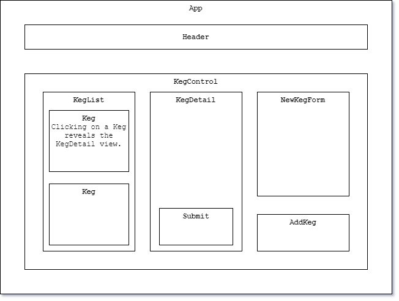

# Tap Room

  ### By [Taylor Somers](https://github.com/taylorsomers/)


<p align="center">
  <a href="#description">Description</a> •
  <a href="#requirements">Requirements</a> •
  <a href="#installation">Installation</a> •
  <a href="#contributors">Contributors</a> •
  <a href="#license">License</a>
</p>


## Description

  


## Languages & Technologies Used:

  ### Programming Languages, Libraries, & Frameworks
  * [C#](https://docs.microsoft.com/en-us/dotnet/csharp/)
  * [Entity Framework Core](https://docs.microsoft.com/en-us/ef/core/)
  * [MySQL](https://www.mysql.com/)
  * [.NET Core](https://dotnet.microsoft.com/download/dotnet-core/2.2)

  ### Operating Systems & Programs
  * [Brave](https://brave.com/)
  * [Microsoft PowerShell](https://docs.microsoft.com/en-us/powershell/)
  * [Microsoft Windows 10](https://www.microsoft.com/en-us/windows/get-windows-10)
  * [MySql Workbench](https://www.mysql.com/products/workbench/)
  * [Postman](https://www.postman.com/)
  * [Visual Studio Code](https://code.visualstudio.com/)


## Requirements
  * [Git v2.62.2 or Later](https://git-scm.com/downloads/)
  * [MySql Workbench](https://www.mysql.com/products/workbench/)
  * [Postman v7.30.1 or Later](https://www.postman.com/downloads/)
  * [Visual Studio Code](https://code.visualstudio.com/)
  * [.NET Core v2.2 or Later](https://dotnet.microsoft.com/download/dotnet-core/2.2)


## Installation

  1.  Make sure you have installed all <a href="#requirements">required software</a>.
  2.  Open your computer's terminal and navigate to the directory in which you would like the program to be stored.
  3.  Enter the command ```git clone https://github.com/taylorsomers/React.tap-room``` in the terminal.


## App Component Diagram




## Known Bugs

| Location : Message |  Situation  | Resolved (Y/N) |  Bug Resolution Strategy |
| ----------- | ----------- | ----------- | ----------- |


## Support & Contact Details

  * You are welcome to contact the [author](https://github.com/taylorsomers/) via GitHub with any concerns, feedback, possible contributions, questions, or suggestions.


### Contributors

  * [Taylor Somers](https://github.com/taylorsomers/)
  * README Photo Credit: [Christin Hume](https://unsplash.com/@christinhumephoto?utm_source=unsplash&utm_medium=referral&utm_content=creditCopyText)


### License

  * This program is free to use under the [GNU Affero General Public License AGPLv3.0](https://www.gnu.org/licenses/agpl-3.0.html). <span></span> © 2020 Taylor Somers. All rights reserved.